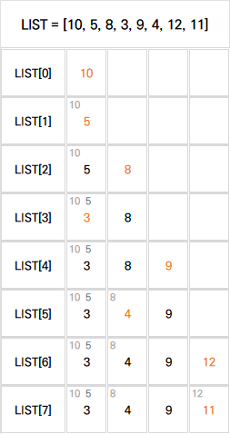

# [BOJ]12015. 가장 긴 증가하는 부분 수열 2

> [12015. 가장 긴 증가하는 부분 수열 2](https://www.acmicpc.net/problem/12015)

<br>

## Longest Increasing Subsequence Size

이분 탐색을 이용하면 최장 증가 부분 수열(이하 LIS)을 O(nlogn)의 시간복잡도로 구할 수 있다.

현재 가지고 있는 숫자 리스트를 `LIST`, LIS의 길이를 계산하기 위해 이용되는 빈 리스트를 `lis`라고 하자. 방법은 다음과 같다.

1. `LIST`의 첫 번째 원소를 `lis`에 추가한다.
2. `LIST`의 원소 `num`은 다음 규칙을 따른다.
   1. `num`이 `LIST[-1]`보다 큰 경우 `lis`의 맨 뒤에 추가한다.
   2. 그렇지 않은 경우 `lis`에서 같는 lower bound를 찾고 그 위치에 갱신한다.
      1. 이때 lower bound를 찾기 위해 이분 탐색이 사용된다. 

```python
# 현재 가지고 있는 숫자 리스트
LIST = list(map(int, sys.stdin.readline().split()))

# 가장 긴 증가하는 부분 수열 리스트
# LIST의 첫번째 원소를 추가한다
lis = [LIST[0]]  

for num in LIST[1:]:
    # 만약 현재 lis의 마지막 숫자보다 크다면 맨 뒤에 추가한다
    # 즉 이때 무조건 LIS의 길이는 증가한다
    if lis[-1] < num:
        lis.append(num)

    # 현재 숫자의 위치를 이분 탐색을 통해 찾고 그 위치에 넣는다
    else:
        idx = binary_search(lis, num)
        lis[idx] = num
```

이 과정이 완료된 후 `lis` 리스트의 크기가 최장 증가 부분 수열의 길이가 된다. 즉 `lis` 리스트는 최장 증가 부분 수열이 아니며 그 길이만 동일한 것이다. 이때 `lis` 리스트의 내부 원소가 다른데 길이만 동일하다는 부분이 헷갈려 여러 설명을 찾아보았고 다음 유투브 강의를 통해 이해할 수 있었다.

[Longest Increasing Subsequence O(n log n) dynamic programming Java source code](https://youtu.be/22s1xxRvy28)

해당 강의는 Patience 게임을 통해 알고리즘을 설명하고 있다. 강의에서 등장하는 Patience 게임은 자신의 카드를 곂쳐 내려놓아 최소한의 카드 덱을 만드는 것을 목표로 한다. 카드를 내려놓는 규칙은 위 코드와 동일하다.

다음과 같은 숫자 카드가 있을 때 내려놓는 순서와 결과적으로 만들어지는 카드덱은 다음과 같다. 곂쳐져 보이지 않는 카드는 상단에 표시해두었다. (아래 표는 [강의의 그림](https://youtu.be/22s1xxRvy28?t=124)을 재구성한 것이다.)



마지막 원소까지 탐색한 뒤 나오는 결과 `[3, 4, 9, 11]` 리스트는 `lis` 리스트의 결과와 동일하다. 

`lis` 리스트는 최종 LIS를 구하는 것이 아니라 최종 LIS를 구하기 위한 최적의 카트 덱 리스트를 기록하는데 목적이 있다. 이 부분을 착각하여 알고리즘을 제대로 이해하지 못했었다. 즉, `[3, 4, 9, 11]` 리스트는 이후 추가될 새로운 여덟 번째 원소에 대비하여 준비된 리스트인 것이다. 하지만 여덟 번째 원소는 없기 때문에 여기서 종료된다.

<br>

## code

```python
import sys


def binary_search(cur_lis, target):
    # 현재 lis에서 목표 숫자가 들어갈 수 있는 자리 즉,
    # lower bound를 반환하는 함수

    left = 0
    right = len(cur_lis)
    while left <= right:
        mid = (left + right) // 2
        if target < cur_lis[mid]:
            right = mid - 1
        elif cur_lis[mid] < target:
            left = mid + 1
        else:  # l[mid] == target
            return mid

    return left


N = int(sys.stdin.readline())
LIST = list(map(int, sys.stdin.readline().split()))

lis = [LIST[0]]  # 가장 긴 증가하는 부분 수열 리스트

for num in LIST[1:]:
    # 만약 현재 lis의 마지막 숫자보다 크다면 맨 뒤에 추가한다
    # 즉 이때 무조건 LIS의 길이는 증가한다
    if lis[-1] < num:
        lis.append(num)

    # 현재 숫자의 위치를 이분 탐색을 통해 찾고 그 위치에 넣는다
    else:
        idx = binary_search(lis, num)
        lis[idx] = num
print(len(lis))  # 길이 출력
```

<br>

## 요약

이분탐색을 이용하여 O(nlogn)의 시간복잡도로 LIS를 구할 수 있다. 이 과정 중에는 항상 최적의 LIS를 구할 수 있도록 원소들을 재정렬해 기록하는 빈 리스트가 필요하며 이 리스트의 최종 모습은 LIS와 동일하지 않을 수 있다.